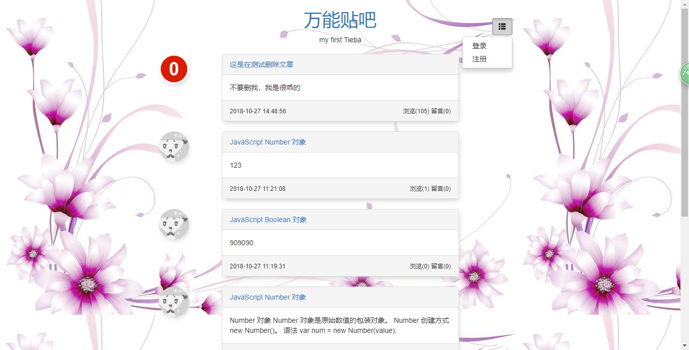
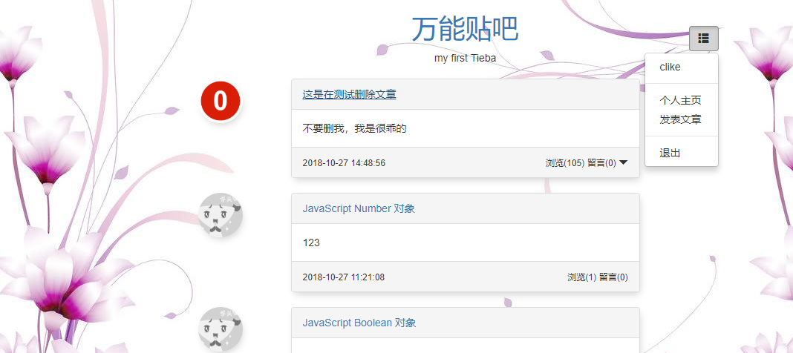
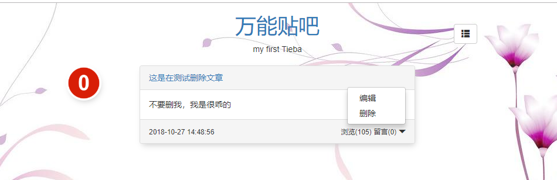
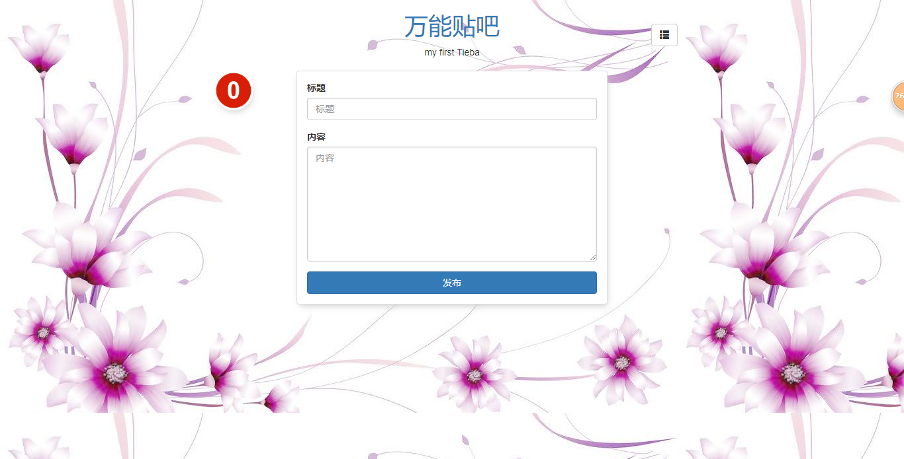

### 安装依赖
```
npm install
```

### 下载安装
```
https://www.mongodb.com/download-center#community
npm install mongodb -g
npm install mongoose -g
```

### 启动/关闭MongoDB服务
```
net start MongoDB 启动

net stop MongoDB 关闭

mongod.exe --remove 移除MongoDB
```

### 启动服务器
```
node index.js
```

### 主页


### 登录后


### 个人主页


### 发布文章

